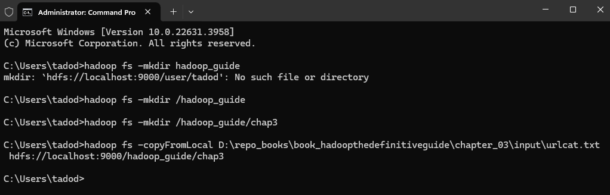

# Chapter 3. The Hadoop Distributed Filesystem

When a dataset outgrows the storage capacity of a single physical machine, it becomes necessary to partition it across a
number of separate machines. Filesystems that manage the storage across a network of machines are called _distributed
filesystems_.

Hadoop comes with a distributed filesystem called HDFS, which stands for _Hadoop Distributed Filesystem_.

## The Design of HDFS

HDFS is a filesystem designed for storing very large files with streaming data access patterns, running on clusters of
commodity hardware.

- _Very large files_: files that are hundreds of megabytes, gigabytes or terabytes in size

- _Streaming data access_: HDFS data processing pattern is a write-once, read-many-times pattern.

- _Commodity hardware_: Hadoop doesn't require expensive, highly reliable hardware. HDFS is designed to carry on working
  without a noticeable interruption to the user in the face of such failure.

Hadoop is not a good fit with:

- Applications require low-latency data access (HBase is better choice than HDFS)

- Lots of small files (a lot of metadata for namenode)

- Multiple writer, arbitrary file modifications

## HDFS Concepts

### Blocks

HDFS has the concept of a block - 128 MB by default. Unlike a filesystem for a single disk, a file in HDFS that is
smaller than a single block does not occupy a full block’s worth of underlying storage. Having a block abstraction for a
distributed filesystem brings several benefits:

- First, a file can be larger than any single disk in the network.

- Second, making the unit of abstraction a block rather than a file simplifies the storage subsystem.

- Third, blocks fit well with replication for providing fault tolerance and availability. To insure against corrupted
  blocks and disk and machine failure, each block is replicated to a small number of physically separate machines (
  typically three).

List the blocks that make up each file in the system (Filesystem check - fsck)

    % hdfs fsck / -files -blocks

### Namenodes and Datanodes

An HDFS cluster has two types of nodes operating in a master-worker pattern: a _namenode_ (the master) and a number of
_datanodes_ (workers).

The namenode manages the filesystem namespace. It maintains the filesystem tree and the metadata for all the files and
directories in the tree (This information on the local disk: the namespace image and the edit log).

Datanodes are the workhorses of the filesystem. They store and retrieve blocks when they are told to (by clients or the
namenode), and they report back to the namenode periodically with lists of blocks that they are storing.

Without the namenode, all the files on the filesystem would be lost since there would be no way of knowing how to
reconstruct the files from the blocks on the datanodes. Hadoop provides two mechanisms for making the namenode resilient
to failure:

- First way: Back up the files that make up the persistent state of the filesystem metadata.

- Second way: Run a _Secondary namenode_. The main role is to periodically merge the namespace image with the edit log
  to prevent the edit log from becoming too large. However, the state of the secondary namenode lags that of the
  primary, so in the event of total failure of the primary, data loss is almost certain.

### Block Caching

Normally a datanode reads blocks from disk, but for frequently accessed files the blocks may be explicitly cached in the
datanode’s memory, in an off-heap _block cache_. Users or applications instruct the namenode which files to cache (and
for how long) by adding a cache directive to a cache pool.

### HDFS Federation

HDFS federation allows a cluster to scale by adding namenodes, each of which manages a portion of the filesystem
namespace.

To access a federated HDFS cluster, clients use client-side mount tables to map file paths to namenodes. This is managed
in configuration using `ViewFileSystem` and the `viewfs://` URIs.

### HDFS High Availability

To recover from a failed namenode in this situation, an administrator starts a new primary namenode with one of the
filesystem metadata replicas and configures datanodes and clients to use this new namenode. The new namenode is not able
to serve requests until it has: (take about 30 minutes)

- Loaded its namespace image into memory
- Replayed its edit log
- Received enough block reports from the datanode to leave safe mode

Hadoop 2 remedied this situation by adding support for HDFS high availability (HA). In this implementation, there are a
pair of namenodes in an active-standby configuration. In the event of the failure of the active namenode, the standby
takes over its duties to continue servicing client requests without a significant interruption.

If the active namenode fails, the standby can take over very quickly (in a few tens of seconds) because it has the
latest state available in memory: both the latest edit log entries and an up-to-date block mapping. The actual observed
failover time will be longer in practice (around a minute or so), because the system needs to be conservative in
deciding that the active namenode has failed.

#### Failover and fencing

The transition from the active namenode to the standby is managed by a new entity in the system called the _failover
controller_. There are various failover controllers, but the default implementation uses ZooKeeper to ensure that only
one namenode is active. Each namenode runs a lightweight failover controller process whose job it is to monitor its
namenode for failures (using a simple heartbeating mechanism) and trigger a failover should a namenode fail.

_Graceful failover_: Failover initiated manually by an administrator.

In the case of an ungraceful failover, however, it is impossible to be sure that the failed namenode has stopped
running. The HA implementation goes to great lengths to ensure that the previously active namenode is prevented from
doing any damage and causing corruption—a method known as fencing.

## The Command-Line Interface

### Basic Filesystem Operations

Detailed on every command

    hadoop fs -help

Copying a file from local filesystem to HDFS

    hadoop fs -copyFromLocal D:\repo_books\book_hadoopthedefinitiveguide\chapter_03\input\urlcat.txt hdfs://localhost:9000/hadoop_guide/chap3

    hadoop fs -copyFromLocal C:\Users\tadod\Documents\Image-Line\FPC\placeholder.txt /hdfs_dir_path

Cutting

    hadoop fs -put C:\Users\tadod\Documents\Image-Line\FPC\placeholder.txt /hdfs_dir_path

Copy the file back to the local filesystem

    hadoop fs -copyToLocal /hdfs_dir_path/quangle.txt C:\quangle.copy.txt

HDFS file listing

    hadoop fs -mkdir books
    hadoop fs -ls .

> File Permissions in HDFS (like POSIX): read (`r`), write (`w`), execute (`x`)

## Hadoop Filesystems

Hadoop has an abstract notion of filesystems, of which HDFS is just one implementation. The Java abstract
`class org.apache.hadoop.fs.FileSystem` represents the client interface to a filesystem in Hadoop, and there are several
concrete implementations.

### Interfaces

Include **HTTP**, **C**, **NFS**, **FUSE**

## The Java Interface

### Reading Data from a Hadoop URL

Using a `java.net.URL` object to open a stream to read the data from

    public class URLCat {

      // make Java recognize Hadoop's hdfs URL scheme
      static {
        URL.setURLStreamHandlerFactory(new FsUrlStreamHandlerFactory());
      }
    
      public static void main(String[] args) throws Exception {
        InputStream in = null;
        try {
          in = new URL(args[0]).openStream();
          IOUtils.copyBytes(in, System.out, 4096, false);
          /*
            input stream            in
            output stream           out
            buffer size to copy     4096 byes
            close when copy done?   false
          */
        } finally {
          IOUtils.closeStream(in);
        }
      }
    }

### Reading Data Using the FileSystem API

Sometimes it is impossible to set a `URLStreamHandlerFactory` for your application. In this case, you will need to use
the `FileSystem` API to open an input stream for a file

A file in a Hadoop filesystem is represented by a Hadoop Path object (not `java.io.File` object cuz too closely tied to
the local filesystem). `Path` as a Hadoop filesystem URI, such as `hdfs://localhost:9000/hadoop_guide/chap3/urlcat.txt`

`FileSystem` is a general filesystem API, so the first step is to retrieve an instance for the filesystem we want to
use—HDFS, in this case.
  
    // Return the default system (specified in _core-site.xml_)
    public static FileSystem get(Configuration conf) throws IOException

    // Use the given URI's scheme, determine the filesystem to use
    public static FileSystem get(URI uri, Configuration conf) throws IOException

    // Retrieve the filesystem as the given user
    public static FileSystem get(URI uri, Configuration conf, String user) throws IOException

A Configuration object encapsulates a client or server’s configuration, which is set using configuration files read from
the classpath, such as _etc/hadoop/core-site.xml_

Some case, retrieve a local filesystem instance

    public static LocalFileSystem getLocal(Configuration conf) throws IOException

With `FileSystem` instance, we invoke `open()` method to get the input stream for a file

    public FSDataInputStream open(Path f) throws IOException // default buffer size of 4 KB
    
    public abstract FSDataInputStream open(Path f, int bufferSize) throws IOException

Class:

    public class FileSystemCat {
      public static void main(String[] args) throws Exception {
        // 1 argument: hdfs://localhost:9000/path
        String uri = args[0]; 

        Configuration conf = new Configuration();
        FileSystem fs = FileSystem.get(URI.create(uri), conf);

        InputStream in = null;
        try {
          in = fs.open(new Path(uri));
          IOUtils.copyBytes(in, System.out, 4096, false);
        } finally {
          IOUtils.closeStream(in);
        }
      }
    }

#### FSDataInputStream

